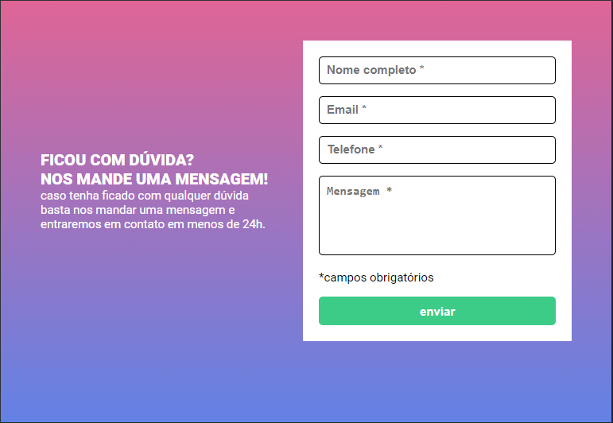
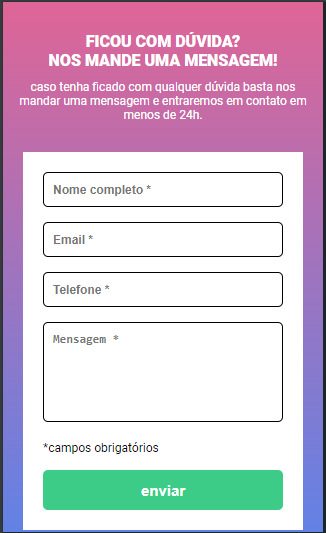

# Quest formulário Javascript
Projeto proposto no curso Dev Quest a fim de testar os aprendizados sobre HTML, CSS e Javascript.

## Versão desktop

## Versão tablet

## Versão mobile

## Aprendizados
Tive bastante dificuldade com desenvolver o JS, mas sinto que aprendi bastante, pois foram dias de pesquisa e muitos erros corrigidos.
Também evolui bastante o conhecimento em HTML, CSS e responsividade.

## Tecnologias utiluzadas
-HTML 

-CSS

-Javascript